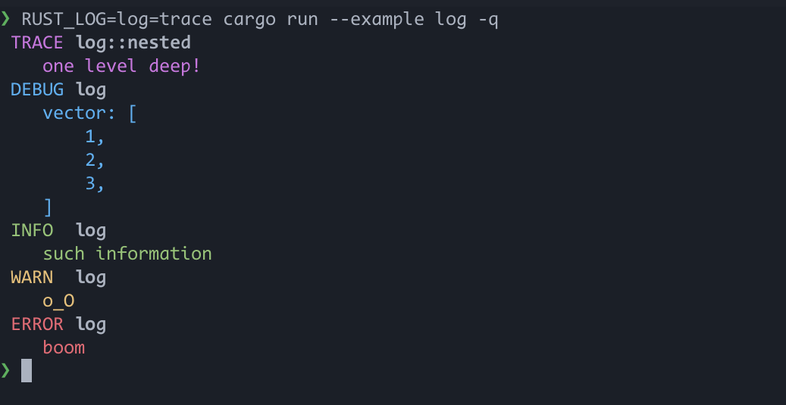

# pretty-env-logger

A simple logger built on top of [env_logger](https://docs.rs/env_logger).
It is configured via an environment variable and writes to standard
error with nice colored output for log levels.



## Usage

Add the dependency to your `Cargo.toml`:

```toml
[dependencies]
log = "0.4"
pretty_env_logger = "0.4"
```

Add some usage to your application:

```rust
fn main() {
    pretty_env_logger::init();

    if !log_enabled!(log::Level::Trace) {
        eprintln!("To see the full demo, try setting `RUST_LOG=log=trace`.");
        return;
    }

    self::nested::deep();
    debug!("vector: {:#?}", vec![1, 2, 3]);
    info!("such information");
    warn!("o_O");
    error!("boom");
}
```

Then run your app with the environmental variable set:

```
RUST_LOG=trace cargo run
```

## License

Licensed under either of

- Apache License, Version 2.0 ([LICENSE-APACHE](LICENSE-APACHE) or http://apache.org/licenses/LICENSE-2.0)
- MIT license ([LICENSE-MIT](LICENSE-MIT) or http://opensource.org/licenses/MIT)

